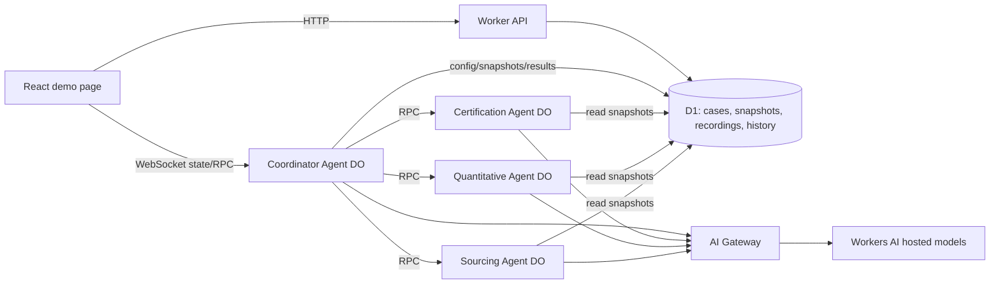

# ProofTrace — Two-hour MVP architecture

ProofTrace checks a sustainability claim against saved public evidence and displays **claim → evidence required →
sources checked → evidence found → gaps → verdict → next action**. The [implementation plan](PLAN.md) defines the
three demo cases and build checkpoints.

Everything runs in Cloudflare account `3550b1d16b78241182c4cb602b695110`. Inference uses only models marked
**Cloudflare-hosted** in the [Workers AI catalog](https://developers.cloudflare.com/workers-ai/models/) through the
Worker's `AI` binding. An AI Gateway routes and logs those calls; it does not imply an external model provider.

## 1. Runtime and request flow



The MVP has four Durable Object classes: one Coordinator per investigation and one shared instance of each of the
three specialists. This preserves separate SQLite memory for each specialist without spending the first hour on six
DO classes. **Claim extraction** and **verdict/action** remain visible trace stages but run inside the Coordinator:
extraction calls Kimi, verdict selection runs deterministic code, and Kimi writes the constrained rewrite/request.
The page may display six lanes (`coordinator`, `extractor`, three specialists, `verdict`) even though a lane is not
necessarily a separate DO instance.

1. The page loads `GET /api/demo` and opens `/agents/coordinator/<investigation-id>` with `useAgent`.
2. `Coordinator.start({caseId, mode})` loads the exact claim and saved source passages. `mode=live` invokes models;
   `mode=replay` plays a stored trace with a persistent **Recorded run** label and no model calls.
3. The extraction stage quotes the input exactly and classifies it. For fixed demo cases, the seeded exact claim is
   authoritative; model extraction may identify subclaims but must not replace the quotation.
4. The Coordinator routes certification, quantitative and sourcing claims to the matching specialist. Each specialist
   loads its feedback lessons, states evidence requirements, reads the saved sources, and returns structured evidence
   and gaps. Sources are treated as **data**; instructions embedded in a page cannot change agent rules.
5. `rules.ts` chooses the verdict. The action stage writes a narrower claim and a draft evidence request when useful.
   The Coordinator appends trace steps to its state and writes the final result to D1.
6. `POST /api/feedback` records a review target (`verdict`, `evidence` or `rewrite`), reason and claim ID. For the Lush
   demo it forwards rewrite feedback to the Sourcing DO, which stores a lesson. A **targeted live rerun** reuses the
   saved snapshot, retrieves that lesson, and generates a new rewrite while retaining the `VAGUE` verdict.

## 2. Quality-first model selection

These are defaults based on the models' documented capabilities, **not a proven ranking for sustainability claims**.
All listed IDs are Cloudflare-hosted Workers AI models. Paid access is acceptable. Keep model ID and supported
reasoning level in `agent_config` so a failed smoke test can be fixed without a code redeploy.

| Stage | Default hosted model | Setting | Why |
|---|---|---|---|
| Coordinator routing | Code; no LLM needed | — | Case type is explicit in the MVP. A model cannot improve a deterministic route. Trace prose can be templates. |
| Claim extraction | [`@cf/moonshotai/kimi-k2.6`](https://developers.cloudflare.com/workers-ai/models/kimi-k2.6/) | `none` | Native structured output and strong tool/vision support; use the seeded quote as the accuracy anchor. |
| Certification specialist | [`@cf/deepseek-ai/deepseek-v4-pro-0813`](https://developers.cloudflare.com/workers-ai/models/deepseek-v4-pro-0813/) | `high` | Scope and issuer matching need careful reasoning. Pro has documented function calling; budget does not justify defaulting to Flash. |
| Quantitative specialist | [`@cf/deepseek-ai/deepseek-v4-pro-0813`](https://developers.cloudflare.com/workers-ai/models/deepseek-v4-pro-0813/) | `high` | Strong documented multi-step reasoning and function calling for baselines, calculations and assumptions. Arithmetic is still done in code. |
| Sourcing and language specialist | [`@cf/moonshotai/kimi-k2.6`](https://developers.cloudflare.com/workers-ai/models/kimi-k2.6/) | `high` | Evidence-bound interpretation and structured output. Compare one Lush result against GLM-5.3 during the initial smoke test; switch only if its quote fidelity and rewrite are better. |
| Action writing | [`@cf/moonshotai/kimi-k2.6`](https://developers.cloudflare.com/workers-ai/models/kimi-k2.6/) | `none` | Write from the rule result and cited evidence; the model cannot change the verdict or invent support. |

[`@cf/zai-org/glm-5.3`](https://developers.cloudflare.com/workers-ai/models/glm-5.3/) is a hosted, capable
alternative for the sourcing specialist, with structured outputs and function calling. Cloudflare describes it
primarily as an agentic coding model; there is no published comparison here proving it better on claim language.
[`@cf/deepseek-ai/deepseek-v4-flash-0731`](https://developers.cloudflare.com/workers-ai/models/deepseek-v4-flash-0731/)
is the lower-latency fallback for Pro if live latency threatens the demo. A fallback must still be Cloudflare-hosted.
No AI Gateway third-party provider IDs, BYOK keys, or external inference endpoints belong in this project.

**First 15-minute model gate:** make one real structured-output call to Kimi, one real function/structured-output call
to DeepSeek Pro, and one Lush rewrite call to GLM-5.3 if time allows. Check schema validity, exact quotations,
source grounding and latency. The model catalog confirms capability, but a live call confirms account access and
actual integration. DeepSeek Pro's model page explicitly lists function calling, so this is a compatibility smoke
test rather than an unresolved documentation question.

Use `workers-ai-provider` with the `AI` binding and `gateway: { id: "prooftrace" }`. With AI SDK v6, use
`generateText({ output: Output.object({ schema }) })` for validated structured results and `generateText` with tools
for tool calls. Pin compatible package versions. Send only reasoning values supported by the selected model and
verify provider-specific option mapping in the smoke test. Reject or retry invalid schemas once within the run's
remaining time budget.

AI Gateway provides logs and optional caching. Caching is disabled by default and only identical requests hit it;
do not assume repeated runs are free. Skip cache for feedback-sensitive live reruns if caching is enabled.

## 3. Agent responsibilities and evidence tools

| Component | Instance | Responsibility | SQLite memory |
|---|---|---|---|
| Coordinator | One per investigation | Run stages, sync trace, enforce timeout, write D1 result | State and trace only |
| Certification Specialist | Shared `main` | Match brand, issuer and **claimed scope** against a certifier's own saved listing | Feedback lessons |
| Quantitative Specialist | Shared `main` | Identify baseline, method, figures and assumptions; use code for arithmetic | Feedback lessons |
| Sourcing Specialist | Shared `main` | Identify vague language and cite narrower, attributable facts | Feedback lessons |

The MVP tool is `get_snapshot(url)`: it returns the exact stored source text, URL, issuer and UTC retrieval time from
D1. `calculate` is a small allowlisted arithmetic function for percentages; never evaluate an arbitrary expression.
Live HTTP fetching, register scraping, reranking and vector search are later work. The Garnier certifier snapshot
must be captured from the certifier's listing, not inferred from Garnier's own page.

Store only explicit feedback lessons for the demo. A lesson includes `claim_type`, `feedback_target`, `lesson`,
`source_case_id`, `created_at` and `baseline_version`. Select relevant lessons by claim type and case ID; show the
selected text on the card. No embeddings are necessary for three cases. Reset deletes feedback lessons and restores
any seeded baseline, which makes the learning demonstration repeatable.

## 4. Data and UI contract

D1 tables needed now:

| Table | Minimum fields |
|---|---|
| `demo_cases` | `id`, `title`, `claim_text`, `claim_type`, `claim_url`, `expected_verdict`, `display_order` |
| `source_snapshots` | `url`, `issuer`, `text`, `retrieved_at`, `content_hash` |
| `recorded_runs` | `case_id`, `trace_json`, `result_json`, `recorded_at` |
| `investigations` | `id`, `case_id`, `mode`, `status`, `result_json`, `created_at` |
| `feedback` | `id`, `investigation_id`, `claim_id`, `target`, `reason`, `created_at` |
| `agent_config` | `agent_id`, `model_id`, `reasoning_level`, `timeout_ms` |

The specialist `lessons` table lives in each specialist's Durable Object SQLite database. Create and seed D1 in
repeatable scripts; make seed inserts idempotent. A recording stores the mode and snapshot timestamp used to produce
it. `POST /api/demo/reset` clears demo history and feedback lessons, and retains snapshots, configuration and
recordings. Restrict that endpoint to the demo operator if the deployed page is public.

```ts
export type Verdict = "BACKED" | "VAGUE" | "NOT_PUBLICLY_VERIFIABLE";
export type AgentId = "coordinator" | "extractor" | "certification" | "quantitative" | "sourcing" | "verdict";

export interface Investigation {
  id: string;
  input: { caseId: string; mode: "live" | "replay" };
  status: "idle" | "running" | "done" | "error";
  steps: Step[];
  claims: ClaimResult[];
  error?: string;
}

export interface Step {
  id: string;
  agent: AgentId;
  kind: "extract" | "route" | "require" | "lesson" | "fetch" | "match" | "gap" | "verdict" | "action";
  label: string;
  detail?: string;               // concise evidence reasoning, never hidden chain-of-thought
  status: "running" | "ok" | "fail" | "info";
  sourceUrl?: string;
  claimId?: string;
  at: number;                    // milliseconds since start; replay preserves this timing
}

export interface Evidence {
  url: string;
  issuer: string;
  quote: string;
  retrievedAt: string;
  independent: boolean;
  supports: "full" | "partial" | "none";
  scopeMatch: boolean;
  satisfies: string[];          // IDs/names of required items this record supports
}

export interface ClaimResult {
  claimId: string;
  text: string;                 // exact source wording
  sourceUrl: string;
  type: "certification" | "quantitative" | "sourcing" | "generic";
  specialist: AgentId;
  required: string[];
  evidence: Evidence[];
  gaps: string[];
  checks: { name: string; pass: boolean }[];
  lessonsApplied: string[];
  verdict: Verdict;
  rewrite?: string;
  nextAction?: string;
  evidenceRequest?: string;     // draft only
}
```

## 5. Deterministic verdict rules

Apply the rules in this order, with explicit unit checks for the three frozen cases:

1. `VAGUE` when the claim itself uses an undefined broad term without a bounded, testable scope. Specific related
   facts elsewhere on a brand page may inform a narrower rewrite but do not retroactively make the broad quote
   specific. Lush's heading follows this rule.
2. `BACKED` only when the claim is specific, **all material required items have no unresolved gaps**, and current
   independent evidence fully supports the exact claim and its scope. A certifier listing supports Garnier brand
   approval; it does not automatically support an “all products” claim. For a saved register snapshot, display the
   snapshot retrieval date; do not call it a live register check.
3. Otherwise `NOT_PUBLICLY_VERIFIABLE`. Self-declared numerical figures, a stated comparison baseline, or partial
   evidence do not by themselves reproduce the numbers. YSL follows this rule until component-level data and method
   are available.

“Current” is a configurable age threshold measured from the source's **retrieval or publication time as appropriate**;
it is not proof that a certification remains valid today. If a required source is stale, mark its currentness check
false and avoid `BACKED` until refreshed. Show: claim specific, evidence found, independent source, scope matches,
evidence current, required items complete. A failed model or fetch returns a partial/error state, never a fabricated
verdict.

## 6. Reliability, deployment and boundaries

- Cap the full live run at 120 seconds. Give individual calls shorter deadlines and retry only when enough run time
  remains. Measure actual latency before deciding what to show live in a two-minute pitch.
- Source snapshots make the demo independent of third-party site availability. Every result links to the original
  page and shows the actual snapshot date. Brand statements are labelled as brand statements.
- Never expose raw provider errors or hidden reasoning to the page. Trace details are short evidence summaries.
- Evidence requests are drafts and are never sent. The deployed page is `noindex`.
- Use the Cloudflare Vite plugin's asset build path; do not assume a hand-written `assets` block without a directory
  is deployable. Route `/agents/*` through `routeAgentRequest`, then handle API routes and assets.

Minimum Wrangler bindings and migrations:

```jsonc
{
  "name": "prooftrace",
  "account_id": "3550b1d16b78241182c4cb602b695110",
  "main": "src/server.ts",
  "compatibility_flags": ["nodejs_compat"],
  "ai": { "binding": "AI" },
  "d1_databases": [{ "binding": "DB", "database_name": "prooftrace", "database_id": "<from wrangler d1 create>" }],
  "durable_objects": { "bindings": [
    { "name": "Coordinator", "class_name": "Coordinator" },
    { "name": "CertificationSpecialist", "class_name": "CertificationSpecialist" },
    { "name": "QuantitativeSpecialist", "class_name": "QuantitativeSpecialist" },
    { "name": "SourcingSpecialist", "class_name": "SourcingSpecialist" }
  ]},
  "migrations": [{ "tag": "v1", "new_sqlite_classes": [
    "Coordinator", "CertificationSpecialist", "QuantitativeSpecialist", "SourcingSpecialist"
  ]}],
  "vars": { "AI_GATEWAY_ID": "prooftrace" }
}
```

Generate Worker types after changing bindings. Do not enable `experimentalDecorators` for Agents SDK `@callable`;
add a new DO migration tag rather than editing an existing deployed migration.

## 7. Repository layout

```
src/server.ts                   # Worker entry, Agents SDK routing, API and assets
src/shared/types.ts             # contract above
src/agents/coordinator.ts       # orchestration, extraction, verdict/action stages, trace
src/agents/certification.ts
src/agents/quantitative.ts
src/agents/sourcing.ts
src/agents/rules.ts             # deterministic verdict rules
src/agents/models.ts            # hosted Workers AI calls and schemas
src/app/                       # React demo page
migrations/ seed/ scripts/      # D1 setup, snapshots and recording
docs/PLAN.md docs/ARCHITECTURE.md
```
