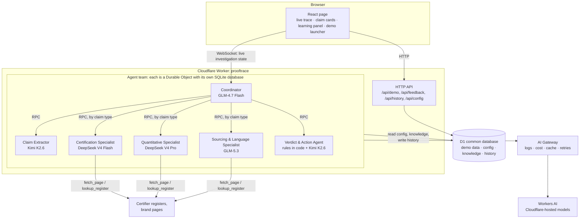

# ProofTrace — Architecture

ProofTrace is a team of specialist AI agents that checks a sustainability claim against public evidence and shows its
work: **claim → evidence required → sources checked → evidence found → gaps → verdict → next action.**

Everything runs on one Cloudflare account (`3550b1d16b78241182c4cb602b695110`, aonishchenko33). There is no separate
backend and no external model provider.

---

## 1. System overview



### Request flow for one investigation

1. The page calls `Coordinator.start(input)` over WebSocket. The input can be a demo case ID, text or a URL.
2. The Coordinator loads the agent configuration from D1 and creates the investigation row. In replay mode it plays back
   a recorded run from D1 and makes no model calls.
3. The **Claim Extractor** returns the claims, each quoted exactly and typed.
4. For each claim, the Coordinator routes by type: certification → Certification Specialist, quantitative → Quantitative
   Specialist, sourcing/generic → Sourcing & Language Specialist. Claims are processed in parallel.
5. Each specialist:
   1. loads the lessons that match this claim from **its own database**;
   2. states the evidence it needs;
   3. collects evidence with its tools;
   4. returns structured evidence records;
   5. writes a reflection lesson to its own database.
6. The **Verdict & Action Agent** applies the verdict rules in code, then writes the clearer claim and the evidence
   request.
7. Every step is appended to the Coordinator's state and pushed to the page as it happens. The final result is written
   to D1.
8. When a reviewer gives feedback on the page, `/api/feedback` stores it in D1, and the Coordinator forwards it to the
   specialist that handled the claim. That specialist writes a lesson to its own database.

---

## 2. Models: one per agent, chosen for its job

All models are served by **Workers AI** on Cloudflare's own GPUs (IDs starting with `@cf/`). No call leaves Cloudflare
for an outside model provider. Cloudflare does not train its own large language models: these are open-weight models
from Moonshot AI, DeepSeek, Zhipu AI, Google and others, **hosted and run by Cloudflare**. The larger ones require paid
access (Workers Paid plan or prepaid credits), which this account has.

| Agent | Model | Price per M tokens (input / output) | Why this model |
|---|---|---|---|
| Coordinator | `@cf/zai-org/glm-4.7-flash` | $0.06 / $0.40 | Routing is mostly code. The model only writes the short progress sentences in the trace, so a fast, cheap model with tool calling is enough |
| Claim Extractor | `@cf/moonshotai/kimi-k2.6` | $0.95 / $4.00 | The whole pipeline depends on this step, so it needs the most reliable structured output. It has a 262k-token context for long product pages, and vision to read packaging photos (stretch). Reasoning is set to `none`, since extraction doesn't need it |
| Certification Specialist | `@cf/deepseek-ai/deepseek-v4-flash-0731` | $0.44 / $1.32 | Its job is fast repeated tool calls: search a register, read the result, match brand and scope. Built for agent work, with parallel tool calls. Reasoning `low` |
| Quantitative Specialist | `@cf/deepseek-ai/deepseek-v4-pro-0813` | $1.32 / $3.96 | The hardest reasoning: baseline, comparison method, arithmetic and hidden assumptions (e.g. "saves 58% *if* the customer refills"). Reasoning `high` |
| Sourcing & Language Specialist | `@cf/zai-org/glm-5.3` | $1.40 / $4.40 | Precise language judgement against the EU rule text, plus long policy pages (1.3M-token context), and it is multilingual for EU claims written in other languages. Reasoning `low`; it cannot be switched off |
| Verdict & Action Agent | rules in code + `@cf/moonshotai/kimi-k2.6` | $0.95 / $4.00 | Code decides the verdict. Kimi writes the clearer claim and the evidence request, where writing quality and a strict output format matter. Reasoning `none` |
| Lesson search (all specialists) | `@cf/baai/bge-m3` (embeddings) | $0.012 | Turns lessons and claims into vectors so each specialist can find the lessons similar to the current claim |
| Passage selection (all specialists) | `@cf/baai/bge-reranker-base` | $0.003 | Ranks the passages of a fetched page against the evidence needed, so each specialist reads only the relevant passages. That cuts tokens and cost |

**Fallbacks.** Each fallback is one row in `agent_config`, so a model can be swapped without a redeploy.
- `@cf/nvidia/nemotron-3-120b-a12b` for the Quantitative Specialist.
- `@cf/google/gemma-4-26b-a4b-it` for the Certification Specialist and the Coordinator.
- `@cf/moonshotai/kimi-k2.6` for the Sourcing & Language Specialist.

**Estimated cost:** about $0.04–0.06 per live investigation, so 100 development runs come to about $5. Replays cost
nothing. AI Gateway caches identical calls, which makes repeated demo runs free.

**To verify at 0:30:** DeepSeek V4 Pro's page lists it as "Reasoning, Agentic" but does not explicitly confirm function
calling. If one tool call fails, switch that agent to Nemotron 3 through `agent_config`.

### How models are called

- All calls go through the AI SDK with Cloudflare's Workers AI provider (`workers-ai-provider`). `generateObject` gives
  output checked against a schema, and `generateText` with tools runs the agent's tool loop.
- Every call goes through **AI Gateway** (`gateway: { id: "prooftrace" }`). The gateway provides request logs to debug
  from, cost per agent, response caching and retries.
- Temperature is 0 for extraction and classification, and 0.3 for rewrites.
- Every response is validated with zod. On a schema failure the call is retried once with the validation error added to
  the prompt, then the agent returns a clear error step.

---

## 3. Agents in detail

Each agent is a separate class and a separate Durable Object. A Durable Object is a small stateful server on
Cloudflare with its **own private SQLite database**. All specialists extend one base class, `SpecialistAgent`, which
provides model calls, lesson loading, tools, timeouts and reflection. A specialist is defined by its configuration.

| Agent | Instances | Instructions (summary) | Knowledge (from D1) | Tools |
|---|---|---|---|---|
| **Coordinator** | One per investigation (`inv-<id>`) | Run the pipeline, route claims, narrate progress, never judge | Routing table | RPC to the other agents |
| **Claim Extractor** | One, shared (`main`) | Quote every environmental or social claim exactly, split multi-figure claims, classify the type, never paraphrase | Claim taxonomy, EU banned generic terms | `fetch_page` |
| **Certification Specialist** | One, shared (`main`) | Verify on the certifier's own register only. The brand's page is not independent evidence. Check that brand and scope match | Certifier directory (register URL, lookup method, scope) | `lookup_register`, `fetch_page` |
| **Quantitative Specialist** | One, shared (`main`) | List what a percentage claim needs (baseline, method, data, assumptions), then check each one | Comparative-claim rules (EU Directive 2024/825, UK competition regulator guidance) | `fetch_page`, `calculate` |
| **Sourcing & Language Specialist** | One, shared (`main`) | Judge whether a claim is specific. Find the specific supported facts that could replace a vague claim | Vague-term list, sourcing substantiation rules | `fetch_page` |
| **Verdict & Action Agent** | One, shared (`main`) | Apply `rules.ts`, then write one clearer claim and one evidence request. Never soften a verdict | Rewrite patterns, request template | none |

Each specialist is a single long-lived instance, so its database keeps accumulating experience in its specialty across
every investigation.

### Tools

| Tool | What it does |
|---|---|
| `fetch_page(url)` | Checks `source_snapshots` in D1 first, so demo sources are pre-loaded. Otherwise it fetches the page with a 10 s timeout and 1 retry, strips it to text, splits it into passages and ranks them with the reranker |
| `lookup_register(certifier, brand)` | Uses the certifier's lookup method from `certifiers` in D1 (URL pattern + what counts as a match) |
| `calculate(expression)` | Safe arithmetic for checking percentages. The model must not do sums in its head |

---

## 4. Data architecture

The system has two levels of storage.

### 4.1 Each agent's own database (Durable Object SQLite)

Each agent's database is private: only that agent reads and writes it. It holds the agent's **experience**.

| Agent | Tables in its own database |
|---|---|
| Coordinator (per investigation) | `trace_steps` (the live trace, synced to the page), `claim_routes`, `run_meta` |
| Every specialist + Extractor + Verdict | `lessons (id, claim_type, lesson, origin: seed/feedback/reflection, embedding, uses, helpful, created_at)` |
| | `source_stats (url_pattern, hits, misses, avg_ms, last_used_at)`: which sources gave usable evidence |
| | `runs (id, investigation_id, claim_id, input_tokens, output_tokens, ms, outcome)`: its own performance log |
| | `memory_meta (baseline_version, reset_at)` |

**Lesson search:** a specialist has at most a few hundred lessons, so it compares vectors in memory against the
embeddings stored in its own database. There is no vector database to set up. The top 3 lessons go into the prompt and
appear on the claim card as "Applied lesson: …".

### 4.2 Common database (D1)

D1 is Cloudflare's shared SQL database, read by every agent and the API. It holds **demo data, configuration,
knowledge and history**. The demo data is pre-built, so a demo starts ready: nothing has to be typed or fetched live.

| Group | Table | Contents |
|---|---|---|
| **Configuration** | `agent_config` | For each agent: model ID, fallback model, reasoning level, temperature, max tokens, timeout, instructions version. Change a model without a redeploy |
| | `app_config` | Rule thresholds (evidence current = 24 months), run cap (120 s), feature flags (live mode on/off, live URL input on/off), small-print text |
| **Knowledge** | `knowledge` | Each specialist's knowledge pack, by specialty and key (markdown), seeded from `/knowledge/*.md` |
| | `certifiers` | Leaping Bunny, Vegan Society, Fairtrade, Soil Association COSMOS, B Corp: register URL, lookup pattern, scope |
| | `trusted_sources` | Allowlist of domains, by specialty |
| | `vague_terms` | Generic terms, with the rule reference for each |
| **Demo data (pre-built)** | `demo_cases` | Garnier, Lush, YSL: title, exact claim text, source URL, expected verdict, talking points, display order |
| | `source_snapshots` | Stored text of every source page for the demo cases, with retrieval time (UTC) and a content hash. `fetch_page` reads these first, so a demo never depends on a live site |
| | `recorded_runs` | Full recorded trace and result of each demo case, for instant replay |
| | `seed_lessons` | Starting lessons for each specialist. Each agent copies them into its own database on first start and on reset |
| **History** | `investigations`, `claims`, `evidence` | Every investigation, its claims, and each piece of evidence with its exact quote |
| | `feedback` | Reviewer verdict feedback: correct / wrong + reason |

### 4.3 Demo reset

`POST /api/demo/reset` restores a known starting point before a pitch. It:
1. clears the demo investigations from D1 history;
2. tells each specialist to reset its own database to `seed_lessons` (same baseline version);
3. keeps configuration, knowledge and snapshots.

The learning moment then works the same way on every run.

### 4.4 Seeding

```
migrations/0001_schema.sql        # D1 tables
seed/0002_config.sql              # agent_config, app_config
seed/0003_knowledge.sql           # knowledge, certifiers, trusted_sources, vague_terms (generated from /knowledge/*.md)
seed/0004_demo.sql                # demo_cases, source_snapshots, seed_lessons
seed/0005_recorded_runs.sql       # generated by `npm run record` after live runs of the 3 cases
```

Apply them with `wrangler d1 execute prooftrace --remote --file <file>`. `npm run seed` runs all of them in order.

---

## 5. Contract between the page and the agents (`src/shared/types.ts`)

```ts
export type Verdict = "BACKED" | "VAGUE" | "NOT_PUBLICLY_VERIFIABLE";
export type AgentId = "coordinator" | "extractor" | "certification" | "quantitative" | "sourcing" | "verdict";

export interface Investigation {             // Coordinator state, synced live to the page
  id: string;
  input: { mode: "live" | "replay"; caseId?: string; text?: string; url?: string };
  status: "idle" | "running" | "done" | "error";
  error?: string;                           // user-readable only
  steps: Step[];
  claims: ClaimResult[];
  retrievedAt?: string;                     // ISO UTC
}

export interface Step {
  id: string;
  agent: AgentId;                           // the page shows one lane per agent, with its model name
  kind: "extract" | "route" | "require" | "lesson" | "fetch" | "match" | "gap" | "verdict" | "action" | "thought";
  label: string;
  detail?: string;                          // the agent's reasoning sentence
  status: "running" | "ok" | "fail" | "info";
  sourceUrl?: string;
  claimId?: string;
  at: number;                               // ms since start; replay uses it for timing
}

export interface Evidence {
  url: string; title: string; issuer: string;
  independent: boolean; supports: "full" | "partial" | "none"; scopeMatch: boolean;
  quote: string; retrievedAt: string;
}

export interface ClaimResult {
  claimId: string;
  text: string;                             // exact wording
  sourceUrl: string;
  type: "certification" | "quantitative" | "sourcing" | "generic";
  specialist: AgentId;
  required: string[];
  evidence: Evidence[];
  gaps: string[];
  checks: { name: string; pass: boolean }[];
  lessonsApplied: string[];
  verdict: Verdict;
  rewrite?: string;
  nextAction?: string;
  evidenceRequest?: string;                 // draft only, never sent
}
```

---

## 6. Verdict rules (`src/agents/rules.ts`)

| Verdict | Rule |
|---|---|
| **VAGUE** | `type` is `generic` or `sourcing` and the claim has no measurable scope, e.g. it relies on terms in `vague_terms`. Applies even when related policies exist |
| **BACKED** | At least one evidence record has `independent && supports = full && scopeMatch`, and it is current: taken from a live register, or dated within `app_config.evidence_max_age_months` |
| **NOT_PUBLICLY_VERIFIABLE** | A specific claim where the evidence is self-declared only, or where at least one `required` item is missing |

Checks shown on every card: *claim is specific*, *evidence found*, *independent source*, *scope matches*, *evidence is
current*.

---

## 7. Reliability and safety

- **Every run finishes.** Page fetch has a 10 s timeout and 1 retry; each model call has a 60 s timeout and 1 retry (the
  larger models are slower); a whole run is capped at 120 s. On failure the run returns a partial result with a clear
  message, e.g. "Couldn't reach lush.com. Showing the evidence found so far."
- **No raw internals in the page.** Model or provider errors go to logs and AI Gateway only. The page shows plain
  messages.
- **Real brands.** Claims are quoted exactly with their URL and retrieval time. The small print reads: *"Based on public
  sources retrieved 26 Sept 2026. The absence of public evidence does not mean a claim is false."* Evidence requests are
  drafts only and are never sent. The page is `noindex`.
- **Spend visibility.** AI Gateway shows cost per agent. `app_config.live_mode` can switch live runs off instantly,
  leaving replay mode.

---

## 8. Cloudflare resources

| Resource | Name | Purpose |
|---|---|---|
| Worker | `prooftrace` | Page, API and agents |
| Durable Object classes | `Coordinator`, `ClaimExtractor`, `CertificationSpecialist`, `QuantitativeSpecialist`, `SourcingSpecialist`, `VerdictAgent` | One class per agent, each with its own SQLite database |
| D1 | `prooftrace` | Common database |
| Workers AI binding | `AI` | Models |
| AI Gateway | `prooftrace` | Logs, cost, cache, retries |

```jsonc
// wrangler.jsonc (key parts)
{
  "name": "prooftrace",
  "account_id": "3550b1d16b78241182c4cb602b695110",
  "main": "src/server.ts",
  "compatibility_flags": ["nodejs_compat"],
  "assets": { "not_found_handling": "single-page-application" },
  "ai": { "binding": "AI" },
  "d1_databases": [{ "binding": "DB", "database_name": "prooftrace", "database_id": "<from wrangler d1 create>" }],
  "durable_objects": { "bindings": [
    { "name": "Coordinator", "class_name": "Coordinator" },
    { "name": "ClaimExtractor", "class_name": "ClaimExtractor" },
    { "name": "CertificationSpecialist", "class_name": "CertificationSpecialist" },
    { "name": "QuantitativeSpecialist", "class_name": "QuantitativeSpecialist" },
    { "name": "SourcingSpecialist", "class_name": "SourcingSpecialist" },
    { "name": "VerdictAgent", "class_name": "VerdictAgent" }
  ]},
  "migrations": [{ "tag": "v1", "new_sqlite_classes": [
    "Coordinator", "ClaimExtractor", "CertificationSpecialist", "QuantitativeSpecialist", "SourcingSpecialist", "VerdictAgent"
  ]}],
  "vars": { "AI_GATEWAY_ID": "prooftrace" }
}
```

- No API keys: the Workers AI binding bills to the account's credits.
- Do not enable `experimentalDecorators` in tsconfig, because it breaks `@callable`.
- Never edit an existing Durable Object migration; add a new tag.

---

## 9. Repository layout

```
src/
  server.ts                     # Worker entry: routeAgentRequest, /api routes, assets
  shared/types.ts               # contract (section 5)
  agents/
    base.ts                     # SpecialistAgent: model calls, lessons, tools, reflection, reset
    coordinator.ts  extractor.ts  certification.ts  quantitative.ts  sourcing.ts  verdict.ts
    rules.ts                    # verdict rules
    tools.ts                    # fetch_page, lookup_register, calculate
    models.ts                   # reads agent_config, calls Workers AI through AI Gateway
  api/                          # demo, reset, feedback, history, config
  app/                          # React page
migrations/  seed/  knowledge/  scripts/record.ts
docs/PLAN.md  docs/ARCHITECTURE.md
```
