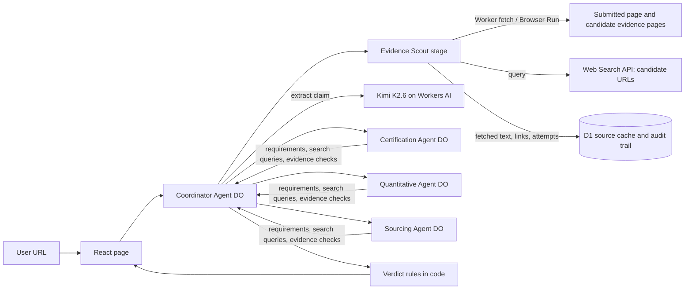
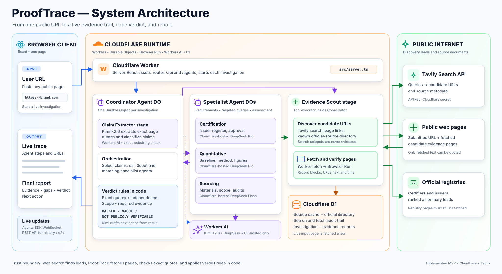

# ProofTrace — URL-first MVP architecture

**Input:** a public URL supplied by the user. **Output:** a trace showing the claim found on that page, what evidence
was needed, web searches and pages checked, quoted evidence, gaps, a code-selected verdict and a next action. The
[two-hour plan](PLAN.md) defines build order and demo cases. Sample URLs only prefill the input field; a live run
collects from the internet at run time.

The Worker, agents, storage, browser renderer and model inference run on Cloudflare account
`3550b1d16b78241182c4cb602b695110`. Models are **Cloudflare-hosted Workers AI** IDs (`@cf/`), never external
inference providers. Broad web discovery uses a search data API to find candidate URLs; this is distinct from the
model provider. Pages behind those URLs are fetched and checked by ProofTrace.

## 1. Who collects the data





The **Coordinator owns collection**. Its Evidence Scout stage is a named, visible tool executor, implemented as a
module inside the Coordinator for the two-hour MVP. Specialists decide **what evidence is required** and return
targeted queries; the Scout decides **which pages to open**, fetches them, and reports successes and failures. This
avoids asking a language model to pretend it searched or to treat a search-result snippet as verified evidence.

| Step | Owner | Actual data operation | Output shown in trace |
|---|---|---|---|
| Open input | Evidence Scout | Validate the user URL, fetch it live, extract readable text and links | Requested and final URL, HTTP/fetch status, retrieval time |
| Extract claims | Coordinator extraction stage, Kimi K2.6 | Quote exact substrings of fetched text and classify them | Claim quote and source URL |
| Plan evidence | Certification, Quantitative or Sourcing Specialist | Return required items and two or three focused search queries | Checklist and query text |
| Discover pages | Evidence Scout | Call `search_web(query)` and combine results with relevant links on the input page and a small official-source directory | Search results and candidate URLs; snippets marked **unverified** |
| Collect sources | Evidence Scout | Fetch promising candidates, normally up to eight pages; preserve page text, issuer, final URL and timestamp | Every fetched, blocked, timed-out or skipped URL |
| Evaluate | Matching specialist | Compare exact page quotes against each required item, including independence and scope | Evidence records, unsupported items and gaps |
| Decide/action | Coordinator | `rules.ts` picks the verdict; Kimi drafts a narrower statement or evidence request from approved evidence | Verdict, citations and next action |

### Fetch and discovery tools

- `fetch_page(url)`: try a bounded Worker [`fetch()`](https://developers.cloudflare.com/workers/runtime-apis/fetch/)
  for simple HTML. If text is missing or the page relies on JavaScript, use Cloudflare [Browser Run Markdown Quick
  Action](https://developers.cloudflare.com/browser-run/quick-actions/markdown-endpoint/) via the `BROWSER` binding.
  Use its [links action](https://developers.cloudflare.com/browser-run/quick-actions/links-endpoint/) when link
  discovery is needed. Keep the actual retrieval method in the record.
- `search_web(query)`: call the [Tavily Search API](https://docs.tavily.com/documentation/api-reference/endpoint/search)
  from the Worker with `TAVILY_API_KEY` stored as a Worker secret. Brave Search is an optional fallback. Take URLs and
  metadata only, without answer generation or model inference. A search hit is a lead, not evidence; `fetch_page`
  must open it before citation. For a matching registry, also search within that issuer's domain.
- `lookup_official_source(name)`: a small D1 directory of certifiers and known issuer domains helps rank or directly
  open an official register. It supplements broad search; it does not replace it for arbitrary URLs.
- `calculate(...)`: safe, bounded arithmetic in code for a quantitative claim. Never evaluate model-generated code.

The [Browser Run `/crawl` endpoint](https://developers.cloudflare.com/browser-run/quick-actions/crawl-endpoint/)
can follow links from one site, but it is asynchronous and does not search the whole web. It is deferred from the
two-hour MVP. Cloudflare AI Search searches indexed data, not arbitrary public pages for a newly submitted URL.

### Bounded investigation loop

1. Normalize and validate the input: `https://` (or safe `http://` redirect), no credentials, local/private/link-local
   destinations or non-web schemes. Recheck every redirect and discovered URL before fetching. Cap page size and
   redirect count.
2. Fetch the submitted page **live**. If it is blocked or has no usable text, stop with an incomplete result and
   show why. Do not silently substitute a saved demo snapshot.
3. Ask Kimi to extract the claim. Verify the returned quote occurs in the fetched text. If there are several claims,
   let the user choose one for the MVP; do not combine unrelated claims into one verdict.
4. The specialist returns required items and targeted queries (for example, certifier + brand; percentage +
   methodology; ingredient + sourcing policy). The Scout runs up to three searches, deduplicates and ranks URLs,
   favoring the named certifier, issuer documents and primary methodology over aggregators.
5. Fetch up to eight candidate pages, with short per-page timeouts and concurrency limits. Search the fetched text
   for candidate passages, then let the specialist judge them. Verify every evidence quote against its fetched page.
6. Stop when material requirements are answered or the 120-second run cap is near. Save the search/fetch audit trail
   and return a result. A blocked page remains a gap in collection, not proof of a false claim.

The Scout may reuse a D1 cached page if fresh enough, but the card shows its original fetch timestamp and labels it
**Cached source**. At least the submitted page is fetched at run time for a **Live run**. Recorded playback is always
labelled **Recorded run** and never presented as live collection.

## 2. Models chosen for evidence quality

All IDs below are marked Cloudflare-hosted in the [Workers AI catalog](https://developers.cloudflare.com/workers-ai/models/).
These are capability-based defaults, not a measured ranking for sustainability claims. Paid access is acceptable.

| Role | Hosted model | Setting | Reason |
|---|---|---|---|
| Coordinator route and Scout tool execution | Code | — | Explicit claim type, URL validation, requests and source records should be deterministic. |
| Claim extraction | [`@cf/moonshotai/kimi-k2.6`](https://developers.cloudflare.com/workers-ai/models/kimi-k2.6/) | `none` | Structured output, with a programmatic exact-substring check against the live page. |
| Certification Specialist | [`@cf/deepseek-ai/deepseek-v4-pro-0813`](https://developers.cloudflare.com/workers-ai/models/deepseek-v4-pro-0813/) | `low` for assessment, `none` for planning | Reason about issuer, brand and certification scope from fetched pages. |
| Quantitative Specialist | [`@cf/deepseek-ai/deepseek-v4-pro-0813`](https://developers.cloudflare.com/workers-ai/models/deepseek-v4-pro-0813/) | `low` for assessment, `none` for planning | Reason about comparison baseline, method and assumptions. Arithmetic runs in code. |
| Sourcing Specialist | [`@cf/deepseek-ai/deepseek-v4-flash-0731`](https://developers.cloudflare.com/workers-ai/models/deepseek-v4-flash-0731/) | `low` for assessment, `none` for planning | Interpret broad wording against specific cited facts within the live run budget. |
| Action writing | [`@cf/moonshotai/kimi-k2.6`](https://developers.cloudflare.com/workers-ai/models/kimi-k2.6/) | `none` | Write only from the rule result and fetched evidence. |

[`@cf/zai-org/glm-5.3`](https://developers.cloudflare.com/workers-ai/models/glm-5.3/) is the hosted extractor fallback.
DeepSeek Flash is the certification and quantitative fallback; Kimi is the sourcing fallback. The implementation
calls the Workers AI `AI` binding directly with JSON schema output. AI Gateway is optional and can be enabled with
`AI_GATEWAY_ID`; it cannot replace live evidence collection. No third-party inference IDs are configured.

## 3. Agents, state and data contract

MVP Durable Objects: Coordinator (one per investigation), and shared Certification, Quantitative and Sourcing
Specialists. The Evidence Scout, extractor and verdict/action are trace stages owned by the Coordinator. The three
specialists may later get private lesson databases, but that is below live retrieval in priority.

D1 tables needed now:

| Table | Minimum contents |
|---|---|
| `investigations` | ID, input URL, run mode, status, selected claim, verdict/result, start/end times |
| `source_pages` | Requested/final URL, issuer, text, content hash, fetched time, fetch method, cache expiry |
| `source_attempts` | Investigation ID, query or URL, stage, status, reason, time, source page ID if fetched |
| `evidence` | Investigation/claim ID, source page ID, exact quote, support level, independence, scope and requirements satisfied |
| `official_sources` | Certifier name, domain and lookup URL pattern where known |
| `demo_cases` | Sample input URL, title and expected regression outcome; no preselected claim or evidence returned to live agents |
| `recorded_runs` | Input URL, trace/result JSON, snapshot times and recording time for labelled backup playback |
| `agent_config` | Role, hosted model ID, supported reasoning level and timeout |

```ts
export type Verdict = "BACKED" | "VAGUE" | "NOT_PUBLICLY_VERIFIABLE";
export type RunMode = "live" | "replay";
export type AgentId = "coordinator" | "scout" | "extractor" | "certification" | "quantitative" | "sourcing" | "verdict";

export interface Investigation {
  id: string;
  input: { url: string; mode: RunMode };
  status: "running" | "done" | "incomplete" | "error";
  steps: Step[];
  claims: ClaimResult[];
  selectedClaimId?: string;
  error?: string;
}

export interface Step {
  id: string;
  agent: AgentId;
  kind: "fetch" | "extract" | "require" | "search" | "open" | "match" | "gap" | "verdict" | "action";
  label: string;
  detail?: string;                 // evidence summary, never hidden chain-of-thought
  status: "running" | "ok" | "fail" | "info";
  url?: string;
  claimId?: string;
  at: number;                      // ms since start
}

export interface Evidence {
  url: string;
  issuer: string;
  quote: string;                    // verified substring of a fetched source page
  retrievedAt: string;
  cached: boolean;
  independent: boolean;
  supports: "full" | "partial" | "none";
  scopeMatch: boolean;
  satisfies: string[];
}

export interface ClaimResult {
  claimId: string;
  text: string;                     // exact substring of the submitted or discovered page
  sourceUrl: string;
  type: "certification" | "quantitative" | "sourcing" | "generic";
  required: string[];
  evidence: Evidence[];
  gaps: string[];
  checkedUrls: { url: string; status: "fetched" | "blocked" | "timeout" | "skipped" }[];
  verdict?: Verdict;               // absent when the investigation is incomplete
  rewrite?: string;
  nextAction?: string;
  evidenceRequest?: string;       // draft only
}
```

The page opens `/agents/coordinator/<investigation-id>` with `useAgent` and calls a method with `{url, mode}`.
`GET /api/demo` returns sample URLs; `GET /api/history` returns past runs. The Coordinator streams state updates
through the Agents SDK and persists its final result in D1. Route `/agents/*` through `routeAgentRequest` before
serving API and assets.

## 4. Verdicts and collection limits

1. `VAGUE` when the exact quote uses an undefined broad term without bounded, testable scope. Other facts found on
   the source site can inform a narrower rewrite but cannot make that quote precise.
2. `BACKED` only for a specific claim with all material requirements met by current, fetched, independent evidence
   matching the exact issuer and scope. A live certifier listing can support Garnier brand approval; it cannot
   automatically verify every Garnier product.
3. `NOT_PUBLICLY_VERIFIABLE` when a specific claim remains unsupported after a completed bounded search. For YSL,
   a brand-stated baseline without the component data or reproducible method does not establish the percentages.

If the submitted page fails to load, web search is unavailable, or the run times out before a meaningful check,
return `incomplete` with no unsupported verdict. Report what was attempted. A verdict is about **publicly found
evidence within this search**, not a legal finding or proof a claim is false. Show actual page retrieval times and
identify self-declared brand statements.

The URL collector must not fetch private network addresses, follow redirects into them, download unbounded files or
execute instructions found in page text. Browser Run and source websites can block automated access; surface that
as a collection failure. Evidence requests are drafts and are never sent.

## 5. Cloudflare setup

The [Browser Run binding](https://developers.cloudflare.com/browser-run/quick-actions/) supports Markdown and links
Quick Actions without a Browser Run API token. It requires a compatibility date of at least `2026-03-24`; local
development needs remote browser mode. The Tavily Search key is separate and is kept in a Wrangler secret.

```jsonc
{
  "name": "prooftrace",
  "account_id": "3550b1d16b78241182c4cb602b695110",
  "main": "src/server.ts",
  "compatibility_date": "2026-09-26",
  "compatibility_flags": ["nodejs_compat"],
  "ai": { "binding": "AI" },
  "browser": { "binding": "BROWSER", "remote": true },
  "d1_databases": [{ "binding": "DB", "database_name": "prooftrace", "database_id": "<from wrangler d1 create>" }],
  "durable_objects": { "bindings": [
    { "name": "Coordinator", "class_name": "Coordinator" },
    { "name": "CertificationSpecialist", "class_name": "CertificationSpecialist" },
    { "name": "QuantitativeSpecialist", "class_name": "QuantitativeSpecialist" },
    { "name": "SourcingSpecialist", "class_name": "SourcingSpecialist" }
  ]},
  "migrations": [{ "tag": "v1", "new_sqlite_classes": [
    "Coordinator", "CertificationSpecialist", "QuantitativeSpecialist", "SourcingSpecialist"
  ]}],
  "vars": { "AI_GATEWAY_ID": "prooftrace" }
}
```

Set `TAVILY_API_KEY` using `wrangler secret put`, never in the repo. Use the Cloudflare Vite plugin's asset
build path. Generate Worker types after changing bindings; do not enable `experimentalDecorators` for `@callable`.

## 6. Repository layout

```
src/server.ts                   # Worker routing, API and assets
src/shared/types.ts             # contract above
src/agents/coordinator.ts       # orchestration, extraction, verdict/action, state
src/agents/evidence-scout.ts    # fetch_page, search_web, link discovery and provenance
src/agents/certification.ts
src/agents/quantitative.ts
src/agents/sourcing.ts
src/agents/rules.ts             # deterministic verdict rules
src/agents/models.ts            # hosted Workers AI calls and schemas
src/app/                       # React URL input, live trace and evidence cards
migrations/ seed/ scripts/      # D1 setup and optional recording
docs/PLAN.md docs/ARCHITECTURE.md
```
