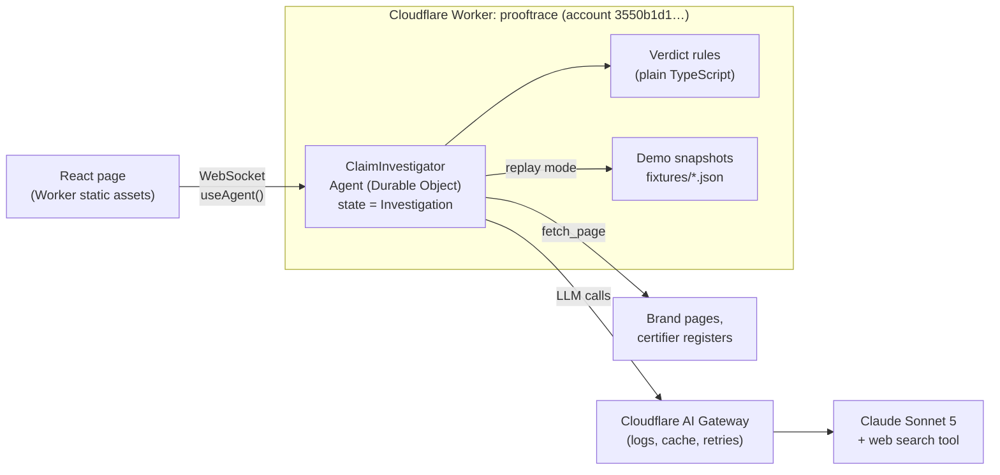

# ProofTrace — Implementation Plan & Architecture

ProofTrace is an agent that checks a sustainability claim against public evidence and shows its work:
**claim → evidence required → sources checked → evidence found → gaps → verdict → next action.**

Track: AI agents. Build time: 4 hours. Team: 2 (Person A = product/frontend/demo, Person B = agent/evidence).

---

## 1. Architecture

**Everything runs in one Cloudflare Worker. No separate backend and no Railway.**

The Cloudflare Agents SDK gives us a stateful agent (a Durable Object) that keeps the investigation's state and
syncs it live to the browser over WebSocket. The same Worker serves the React page. Nothing in the build needs
Python, long-running jobs, a relational database or heavy PDF tooling, so none of them justify a second service.
Railway only becomes relevant if we later add large PDF parsing or batch jobs longer than a few minutes.



### Components

| Component | Tech | Owner |
|---|---|---|
| Page | React + Vite, `@cloudflare/vite-plugin`, served as Worker assets | A |
| Live connection | `useAgent({ agent: "ClaimInvestigator", name: investigationId })` from `agents/react`; state updates stream automatically | A |
| Agent | `ClaimInvestigator extends Agent<Env, Investigation>` from the `agents` package; `@callable() start(input)` | B |
| LLM | Claude Sonnet 5 through AI Gateway (one `ANTHROPIC_API_KEY` secret). The gateway provides request logs for debugging and response caching for repeat runs | B |
| Web search | Claude's built-in web search tool, so we don't build a search API | B |
| Page fetch | Worker `fetch()` → HTML stripped to text; fall back to a snapshot if the site blocks bots | B |
| Verdict | Deterministic rules in `src/agent/rules.ts`. The LLM extracts and classifies evidence; **code decides the verdict** | B |
| Demo snapshots | Recorded live runs stored in `fixtures/{garnier,lush,ysl}.json` and replayed with their original timing | B records, A triggers |

### Why the agent is a Durable Object

- Each investigation is one agent instance. `setState()` pushes every new step to the page, so the investigation
  shows as a live trace instead of a spinner. This is the "show the agent working" moment for the jury.
- State persists: a page refresh mid-run reconnects to the same instance and continues from where it was.
- It needs no database, queue or separate API server.

### Cloudflare configuration

```jsonc
// wrangler.jsonc (key parts)
{
  "name": "prooftrace",
  "account_id": "3550b1d16b78241182c4cb602b695110",   // aonishchenko33 — pinned; login sees 3 accounts
  "main": "src/server.ts",
  "compatibility_flags": ["nodejs_compat"],
  "assets": { "not_found_handling": "single-page-application" },
  "durable_objects": { "bindings": [{ "name": "ClaimInvestigator", "class_name": "ClaimInvestigator" }] },
  "migrations": [{ "tag": "v1", "new_sqlite_classes": ["ClaimInvestigator"] }],
  "vars": { "AI_GATEWAY_ID": "prooftrace" }
}
```

- Secret: `wrangler secret put ANTHROPIC_API_KEY`.
- Do **not** enable `experimentalDecorators` in tsconfig, because it breaks `@callable`.
- Deploy target: `prooftrace.<subdomain>.workers.dev`. Add `X-Robots-Tag: noindex`, because the page names real brands.

### Repository layout (split by owner so the two people don't create merge conflicts)

```
src/
  server.ts            # Worker entry: routeAgentRequest + assets            (B)
  shared/types.ts      # THE CONTRACT — frozen at 0:30, both read it          (A+B)
  agent/
    investigator.ts    # ClaimInvestigator Agent class                        (B)
    tools.ts           # fetch_page, lookup_register, draft_evidence_request  (B)
    rules.ts           # deterministic verdict rules                          (B)
    prompts.ts         # extraction / evidence-requirement prompts            (B)
  app/
    App.tsx, components/*, styles.css                                         (A)
    mock.ts            # fake Investigation stream for building before 1:45   (A)
fixtures/garnier.json, lush.json, ysl.json                                    (B)
```

---

## 2. The contract (`src/shared/types.ts`) — freeze at 0:30

The page renders **only** from `Investigation` state. Person A builds against `mock.ts` until the backend is
ready, so neither person waits on the other.

```ts
export type Verdict = "BACKED" | "VAGUE" | "NOT_PUBLICLY_VERIFIABLE";

export interface Investigation {
  id: string;
  input: { mode: "live" | "replay"; caseId?: "garnier" | "lush" | "ysl"; text?: string; url?: string };
  status: "idle" | "running" | "done" | "error";
  error?: string;                 // user-readable message only, never raw provider output
  steps: Step[];                  // the visible trace, appended as the agent works
  claims: ClaimResult[];
  retrievedAt?: string;           // ISO UTC, shown in the small print
}

export interface Step {
  id: string;
  kind: "extract" | "require" | "search" | "fetch" | "match" | "gap" | "verdict" | "action" | "thought";
  label: string;                  // "Searching Cruelty Free International register"
  detail?: string;                // agent's reasoning sentence, shown in quotes
  status: "running" | "ok" | "fail" | "info";
  sourceUrl?: string;
  claimId?: string;
  at: number;                     // ms since run start (replay uses this for timing)
}

export interface Evidence {
  url: string;
  title: string;
  issuer: string;                 // "Cruelty Free International", "YSL Beauty"
  independent: boolean;           // third party, not the brand
  supports: "full" | "partial" | "none";
  scopeMatch: boolean;            // covers this product/brand, not a different one
  quote: string;                  // exact supporting text
  retrievedAt: string;            // ISO UTC
}

export interface ClaimResult {
  claimId: string;
  text: string;                   // exact wording as written by the brand
  sourceUrl: string;
  type: "certification" | "quantitative" | "generic" | "sourcing";
  required: string[];             // "Packaging component weights", "Calculation method"
  evidence: Evidence[];
  gaps: string[];
  checks: { name: string; pass: boolean }[];   // drives "4/5 checks passed", no invented confidence %
  verdict: Verdict;
  rewrite?: string;               // clearer claim the evidence supports
  nextAction?: string;
  evidenceRequest?: string;       // draft email text; copied by user, never sent
}
```

---

## 3. Agent workflow (Person B)

For each input: extract the claims first, then run steps 2–6 for each claim.

1. **Extract**: the LLM returns claims with their exact wording and a `type`. For example, a claim with several figures (58% / 59% / 42%) becomes one claim per figure.
2. **Require**: the LLM states what evidence would prove the claim *before any search*. This becomes a `require` step
   with the reasoning shown, and it is the part that shows intelligence.
3. **Collect**: `lookup_register` for certification claims (checks the certifier's own register first), and the web search tool and
   `fetch_page` for everything else. Allowlist of trusted sources: crueltyfreeinternational.org, vegansociety.com, the brand's official
   pages, fairtrade.org.uk, soilassociation.org.
4. **Match**: the LLM fills one `Evidence` record per source (issuer, independent, supports, scopeMatch, quote).
5. **Verdict**: `rules.ts` computes the verdict (below). The LLM never picks the verdict.
6. **Next action**: for a gap, the LLM drafts the evidence request. For a vague claim, it writes a specific rewrite that the
   evidence found supports.

### Verdict rules (`rules.ts`)

| Verdict | Rule |
|---|---|
| **VAGUE** | `type = generic` (the claim relies on words like *ethical, sustainable, responsible, eco, green, natural, clean, conscious*) and states no measurable scope. Applies even when related policies exist. |
| **BACKED** | At least one evidence record has `independent && supports = full && scopeMatch`, *and* it is current (live register retrieved today, or dated within 24 months). |
| **NOT_PUBLICLY_VERIFIABLE** | A specific claim where the evidence is self-declared only, or where at least one `required` item is missing. |

The checks list shown in each card: *claim is specific*, *evidence found*, *independent source*, *scope matches*, *evidence is current*.

### Every run must finish with an answer

- Page fetch: 10 s timeout, 1 retry. LLM call: 30 s timeout, 1 retry. Whole run: 120 s cap.
- On any failure the run stops with a partial result and a clear `error` message, e.g. "Couldn't reach lush.com.
  Showing the evidence found so far." The run never spins indefinitely, and provider error text never reaches the UI.

---

## 4. Demo cases (freeze at 0:30; quote exactly, with URL)

| Case | Claim (exact public wording) | Expected result | The moment |
|---|---|---|---|
| Garnier | "Approved by Cruelty Free International under the Leaping Bunny programme" (approved 5 Mar 2021, all products) | 🟢 BACKED | The agent confirms it on **the certifier's own register**, not the brand's page |
| Lush | "Ethically sourced ingredients". *To do: capture the exact quote and URL where Lush uses it* | 🟡 VAGUE | The agent finds Lush's real Ethical Buying facts (buys direct from producers, cocoa butter certified fair-trade and organic) and rewrites the claim around them. The verdict targets **the phrase, not the company** |
| YSL Libre refill | "Save 58% glass, 59% plastics and 42% paper" vs 3 non-refillable 50 ml bottles | 🟠 NOT PUBLICLY VERIFIABLE | Baseline found ✓, component weights ✗, the refill assumption is flagged, and the evidence request is drafted |

Small print shown on every result:
*"Based on public sources retrieved 26 Sept 2026. The absence of public evidence does not mean a claim is false."*

---

## 5. Timeline and split

| Time | Person A — product / frontend / demo | Person B — agent / evidence |
|---|---|---|
| 0:00–0:30 | Scaffold the project (Vite + Worker + Agents SDK) and deploy "hello" to the account once, to prove the deploy pipeline works. Write `mock.ts` | Write `types.ts` (the contract), the verdict rules and the prompts. Capture the exact Lush quote and URL. **0:30: both people sign off on `types.ts` and the 3 demo cases** |
| 0:30–1:45 | Single page: input (text or URL, plus 3 demo buttons), live trace, claim cards, verdict badges, "Request Missing Evidence" modal. Build against the mock | `ClaimInvestigator`: extract → require → collect → match → rules → next action. Test with the text input |
| 1:45–2:30 | Switch from the mock to `useAgent`. Style the cards. Add the small print | Certifier register lookup, gap detection, evidence request drafting. Timeouts and error handling |
| 2:30–3:10 | Polish the 3 demo flows end to end on the **deployed** URL | Run each case live, fix its output, record `fixtures/*.json`, add replay mode |
| 3:10–3:40 | Rehearse the 2-minute pitch. **Record the backup video** | Fix bugs and latency, format sources |
| 3:40–4:00 | Submission text and screenshots | Final deploy. Check that all 3 replays and one live run work on the deployed URL |

**Cut order if behind:** arbitrary URL input → live web search (keep register lookup + fixtures) → several claims per
input → the page restyle. PDF upload is out of scope from the start.

**Always keep:** claim → reasoning → evidence → gap → verdict → next action, visible live.

---

## 6. Decisions and open items

| Item | Status |
|---|---|
| Cloudflare account | `3550b1d16b78241182c4cb602b695110` (aonishchenko33), pinned in `wrangler.jsonc` |
| Separate backend / Railway | **Not needed** |
| Database | **None for the build.** Each agent keeps its own state in the Durable Object's built-in SQLite; fixtures are bundled JSON. If we add shared data (investigation history, a list of past checks) → **Cloudflare D1**. Only if D1 is not enough → Supabase |
| LLM | Claude Sonnet 5 through AI Gateway. **Needs an Anthropic API key.** Fallback: Workers AI model with no web search, limited to the allowlist fetch + fixtures |
| Lush exact quote + URL | Open. Person B, before 0:30 |
| Evidence request | Draft only, never sent to any brand |
