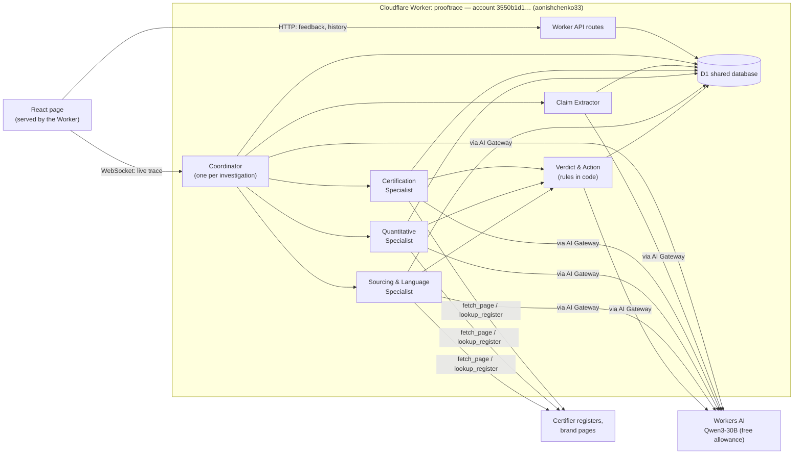

# ProofTrace — Implementation Plan & Architecture

ProofTrace is a team of AI agents that checks a sustainability claim against public evidence and shows its work:
**claim → evidence required → sources checked → evidence found → gaps → verdict → next action.**

Track: AI agents. Build time: 4 hours. Team: 2 (Person A = product/frontend/data, Person B = agents).
Budget: **zero spend**. Only Cloudflare's own models and free allowances.

---

## 1. Principles

1. **Everything on Cloudflare, free tier only.** Models come from Workers AI, which runs open models on Cloudflare's own
   hardware. No external LLM providers and no separate backend (no Railway).
2. **Specialist agents, not one generalist.** Each agent has its own instructions, its own knowledge pack and its own
   tools, and it learns from past cases in its specialty.
3. **Code decides verdicts.** Agents extract, reason and collect evidence; deterministic rules pick
   BACKED / VAGUE / NOT PUBLICLY VERIFIABLE. The result is repeatable and explainable to the jury.
4. **One shared database (D1) as the system of record.** Agents keep live working state in their own storage, and
   everything that must be shared, queried or learned from goes into D1.

---

## 2. Agent team

Each agent is a separate class built on Cloudflare's Agents SDK. Each class runs as a Durable Object: a small, stateful
server with its own built-in storage. Agents call each other directly with typed RPC calls (`getAgentByName`).

| Agent | Instance | Speciality | Knowledge pack | Tools |
|---|---|---|---|---|
| **Coordinator** | one per investigation | Runs the investigation, sends each claim to the right specialist, and publishes the live trace to the page | Routing table (claim type → specialist) | calls other agents |
| **Claim Extractor** | one, shared | Splits a page or text into claims, quoted exactly and typed (certification / quantitative / sourcing / generic) | Claim taxonomy, EU list of banned generic terms (Directive 2024/825) | `fetch_page` |
| **Certification Specialist** | one, shared | Verifies "certified / approved / member of X" claims on **the certifier's own register** | Certifier directory: Leaping Bunny (Cruelty Free International), Vegan Society, Fairtrade, Soil Association COSMOS, B Corp. Each entry has the register URL, the lookup method, and what the certificate covers | `lookup_register`, `fetch_page` |
| **Quantitative Claims Specialist** | one, shared | Checks "X% less / reduced / saves" claims: baseline, method, underlying data, assumptions | Rules for comparative claims (EU Directive 2024/825, UK competition regulator guidance): what a proven % claim needs | `fetch_page` |
| **Sourcing & Language Specialist** | one, shared | Checks "ethically / responsibly sourced", "natural", "sustainable": whether the claim is specific, and which specific supported facts exist | Vague-term list, what substantiates sourcing claims (named standard, share of ingredients covered, audits) | `fetch_page` |
| **Verdict & Action Agent** | one, shared | Applies the verdict rules (code), then writes the clearer claim and the evidence request | Rewrite patterns, evidence-request template | none (LLM + rules) |

### How the agents learn

The system is honest about what "learning" means here: agents **remember and reuse lessons**. The model itself is never
retrained. There are three sources of lessons, all stored in D1 and tagged with the specialty:

1. **Reviewer feedback.** Each verdict card has "Correct" and "Wrong, because…" buttons. A wrong verdict plus its reason
   becomes a lesson for that specialist.
2. **Self-reflection after each run.** The specialist writes one short lesson, such as "Leaping Bunny register search
   works by brand name; the brand's own page is not independent evidence".
3. **Source reliability.** Each source records how often it gave usable evidence. Specialists try the most reliable
   sources first.

Before each task, a specialist loads its top lessons for that claim type into its prompt. The page shows a
**"What this agent has learned"** panel for each specialist. This is visible in the demo: run a case, mark a verdict
wrong with a reason, re-run it, and the specialist applies the lesson.

---

## 3. Architecture



### Storage: who keeps what

| Store | What it is | What goes in it |
|---|---|---|
| **Durable Object storage** (built into each agent) | Each agent instance has its own small private SQLite database, stored by Cloudflare. It persists, but only that instance can read it | The Coordinator's live trace for one investigation, synced to the page as it changes. Specialists' in-progress working memory. **Nothing that needs to be shared** |
| **D1** (Cloudflare's shared SQL database) | One shared database that every agent and API route reads and writes | Investigations, claims, evidence (with the exact quote and retrieval time), verdicts, reviewer feedback, lessons, source reliability, knowledge packs, cached page text, daily model-usage counter |

D1 free tier: 5 GB of storage and 5M rows read per day, far more than we need. If D1 turns out not to be enough, the
next step is Supabase.

### D1 tables

```sql
investigations (id, input_text, input_url, mode, status, error, created_at)
claims         (id, investigation_id, text, source_url, type, specialist, verdict, checks_json, rewrite, next_action, evidence_request)
evidence       (id, claim_id, url, title, issuer, independent, supports, scope_match, quote, retrieved_at)
feedback       (id, claim_id, correct, reason, created_at)
lessons        (id, specialty, claim_type, lesson, origin /* feedback|reflection */, uses, created_at)
sources        (url_pattern, specialty, hits, misses, last_used_at)        -- source reliability
knowledge      (specialty, key, content)                                   -- knowledge packs, seeded from /knowledge/*.md
page_cache     (url, text, fetched_at)                                     -- saves fetches and model allowance
usage          (day, neurons)                                              -- free-allowance guard
```

### Models (Workers AI, free)

The free allowance is **10,000 neurons per day** on every plan. A neuron is Workers AI's unit of compute.

| Use | Model | Why |
|---|---|---|
| All agents | `@cf/qwen/qwen3-30b-a3b-fp8` | Cheapest model with tool calling (4,625 / 30,475 neurons per million input / output tokens). 32k-token context |
| Fallback if Qwen output is poor | `@cf/openai/gpt-oss-20b` (open-weights model hosted by Cloudflare) | Similar cost (18,182 / 27,273). Try it at 1:45 on the 3 demo cases |
| Not used | Llama 3.3 70B | About 5× the cost per run. It would fit only ~7 live runs a day |

**Estimate:** about 6 model calls per investigation, costing roughly 300–400 neurons. That is **about 25 live runs a
day** on the free allowance. Replays cost nothing.

Guards that keep spend at zero:
- The `usage` table counts neurons per day. At 9,000, live mode switches off and the page offers replay mode with a
  clear message.
- AI Gateway (free) caches identical calls, so re-running a demo case is free.
- Qwen's step-by-step "thinking" output is switched off for extraction and classification, because it uses output
  tokens.
- Every model response is checked against a schema (zod). On failure the call is retried once, then the agent returns a
  clear error. Workers AI does not guarantee the JSON format.

### No web search: curated sources instead

Workers AI has no built-in web search, and paid search APIs are out. The specialists therefore use **their knowledge
packs**, which list trusted source URLs, plus the claim's own page. They fetch these with the Worker's `fetch()` and
store the text in `page_cache`. This is also a better story for the jury: evidence comes from known registers, not from
whatever a search engine ranks first.

Stretch goal: Cloudflare AI Search, which is free during its beta, could crawl the trusted domains into an index for
each specialty.

### Cloudflare configuration

```jsonc
// wrangler.jsonc (key parts)
{
  "name": "prooftrace",
  "account_id": "3550b1d16b78241182c4cb602b695110",   // aonishchenko33 — pinned; this login sees 3 accounts
  "main": "src/server.ts",
  "compatibility_flags": ["nodejs_compat"],
  "assets": { "not_found_handling": "single-page-application" },
  "ai": { "binding": "AI" },
  "d1_databases": [{ "binding": "DB", "database_name": "prooftrace", "database_id": "<from wrangler d1 create>" }],
  "durable_objects": { "bindings": [
    { "name": "Coordinator", "class_name": "Coordinator" },
    { "name": "ClaimExtractor", "class_name": "ClaimExtractor" },
    { "name": "CertificationSpecialist", "class_name": "CertificationSpecialist" },
    { "name": "QuantitativeSpecialist", "class_name": "QuantitativeSpecialist" },
    { "name": "SourcingSpecialist", "class_name": "SourcingSpecialist" },
    { "name": "VerdictAgent", "class_name": "VerdictAgent" }
  ]},
  "migrations": [{ "tag": "v1", "new_sqlite_classes": [
    "Coordinator", "ClaimExtractor", "CertificationSpecialist", "QuantitativeSpecialist", "SourcingSpecialist", "VerdictAgent"
  ]}]
}
```

- No secrets needed: the Workers AI binding bills to the account's free allowance.
- Do **not** enable `experimentalDecorators` in tsconfig, because it breaks `@callable`.
- Deploy target: `prooftrace.<subdomain>.workers.dev` with `X-Robots-Tag: noindex`, because the page names real brands.

### Keeping 6 agents buildable in 4 hours

All specialists extend one base class, `SpecialistAgent`. It handles loading the knowledge pack and lessons, calling
the model, validating the schema, retries, timeouts, writing evidence to D1 and writing the reflection. A new specialist
is then about 40 lines of configuration: instructions, knowledge key, tools and output schema.

### Repository layout (split by owner)

```
src/
  server.ts                  # Worker entry: routeAgentRequest + /api routes + assets   (B routes agents, A routes api)
  shared/types.ts            # THE CONTRACT — frozen at 0:30                              (A+B)
  agents/
    base.ts                  # SpecialistAgent base class                                (B)
    coordinator.ts           # Coordinator                                               (B)
    extractor.ts             # Claim Extractor                                           (B)
    certification.ts, quantitative.ts, sourcing.ts                                       (B)
    verdict.ts + rules.ts    # rules in code + rewrite / evidence request                 (B)
    tools.ts                 # fetch_page, lookup_register (uses page_cache)              (B)
  api/                       # feedback, history, lessons, usage                          (A)
  app/                       # React page, components, mock.ts                            (A)
migrations/0001_init.sql     # D1 schema                                                  (A)
knowledge/*.md               # knowledge packs, seeded into D1                            (B writes, A seeds)
fixtures/{garnier,lush,ysl}.json   # recorded live runs for replay                        (B)
```

---

## 4. The contract (`src/shared/types.ts`) — freeze at 0:30

The page renders the live trace from the Coordinator's state. Person A builds against `mock.ts` until the agents are
ready.

```ts
export type Verdict = "BACKED" | "VAGUE" | "NOT_PUBLICLY_VERIFIABLE";
export type Specialty = "extractor" | "certification" | "quantitative" | "sourcing" | "verdict";

export interface Investigation {            // Coordinator state, synced to the page
  id: string;
  input: { mode: "live" | "replay"; caseId?: "garnier" | "lush" | "ysl"; text?: string; url?: string };
  status: "idle" | "running" | "done" | "error";
  error?: string;                          // user-readable only, never raw model/provider output
  steps: Step[];
  claims: ClaimResult[];
  retrievedAt?: string;                    // ISO UTC
}

export interface Step {
  id: string;
  agent: Specialty | "coordinator";        // which agent is speaking; the page shows one lane or colour per agent
  kind: "extract" | "route" | "require" | "lesson" | "fetch" | "match" | "gap" | "verdict" | "action" | "thought";
  label: string;                           // "Checking Cruelty Free International register"
  detail?: string;                         // the agent's reasoning sentence
  status: "running" | "ok" | "fail" | "info";
  sourceUrl?: string;
  claimId?: string;
  at: number;                              // ms since run start; replay uses it for timing
}

export interface Evidence {
  url: string; title: string; issuer: string;
  independent: boolean; supports: "full" | "partial" | "none"; scopeMatch: boolean;
  quote: string; retrievedAt: string;
}

export interface ClaimResult {
  claimId: string;
  text: string;                            // exact brand wording
  sourceUrl: string;
  type: "certification" | "quantitative" | "sourcing" | "generic";
  specialist: Specialty;
  required: string[];
  evidence: Evidence[];
  gaps: string[];
  checks: { name: string; pass: boolean }[];
  lessonsApplied: string[];                // shown on the card: "Applied lesson: …"
  verdict: Verdict;
  rewrite?: string;
  nextAction?: string;
  evidenceRequest?: string;                // draft only, never sent
}
```

---

## 5. Verdict rules (`rules.ts`)

| Verdict | Rule |
|---|---|
| **VAGUE** | `type = generic` or `sourcing`, and the claim states no measurable scope, e.g. it relies on *ethical, sustainable, responsible, eco, green, natural, clean, conscious*. Applies even when related policies exist. |
| **BACKED** | At least one evidence record has `independent && supports = full && scopeMatch`, and it is current: taken from a live register today, or dated within 24 months. |
| **NOT_PUBLICLY_VERIFIABLE** | A specific claim where the evidence is self-declared only, or where at least one `required` item is missing. |

The checks list shown on each card: *claim is specific*, *evidence found*, *independent source*, *scope matches*,
*evidence is current*.

**Every run must finish with an answer:** page fetch has a 10 s timeout and 1 retry; each model call has a 30 s timeout
and 1 retry; a whole run is capped at 120 s. On failure the run returns a partial result with a clear message. It never
spins indefinitely.

---

## 6. Demo cases (freeze at 0:30; quote exactly, with URL)

| Case | Claim (exact public wording) | Specialist | Expected result |
|---|---|---|---|
| Garnier | Approved by Cruelty Free International under the Leaping Bunny programme (5 Mar 2021, all products) | Certification | 🟢 BACKED, confirmed on the certifier's register |
| Lush | "Ethically sourced ingredients". *To do: exact quote + URL* | Sourcing & Language | 🟡 VAGUE. The phrase is vague, not the company. The rewrite uses Lush's real facts: buying direct from producers, cocoa butter certified fair-trade and organic |
| YSL Libre refill | "Save 58% glass, 59% plastics and 42% paper" vs 3 non-refillable 50 ml bottles | Quantitative | 🟠 NOT PUBLICLY VERIFIABLE: baseline ✓, component weights ✗, refill assumption flagged, evidence request drafted |

**Learning moment (demo step 4):** run the Lush case, mark its verdict "Wrong, because Lush names fair-trade cocoa
butter", and re-run it. The card then shows "Applied lesson: …" and a sharper rewrite.

Small print on every result: *"Based on public sources retrieved 26 Sept 2026. The absence of public evidence does not
mean a claim is false."*

---

## 7. Timeline and split

| Time | Person A — frontend / data / demo | Person B — agents |
|---|---|---|
| 0:00–0:30 | Scaffold (Vite + Worker + Agents SDK), `wrangler d1 create`, `0001_init.sql`, deploy "hello" once to prove the deploy pipeline works. Write `mock.ts` | Write `types.ts`, `rules.ts` and the 4 knowledge packs. Capture the Lush quote. **0:30: both people sign off on the contract and the demo cases** |
| 0:30–1:45 | Page: input + 3 demo buttons, live trace with one lane per agent, claim cards, "Request Missing Evidence" modal. Feedback + lessons API, knowledge seeding | `SpecialistAgent` base, Coordinator, Extractor, Certification Specialist. First end-to-end run on the Garnier case |
| 1:45–2:30 | Switch from the mock to the real Coordinator. Add the "What this agent has learned" panel and the usage counter | Quantitative + Sourcing specialists, Verdict & Action agent, reflection lessons. Compare Qwen with gpt-oss-20b on the 3 cases and keep the better one |
| 2:30–3:10 | Polish the 3 demo flows and the learning moment on the **deployed** URL | Run each case live, record `fixtures/*.json`, add replay mode and the neuron guard |
| 3:10–3:40 | Rehearse the pitch. **Record the backup video** | Fix bugs, latency, source formatting |
| 3:40–4:00 | Submission text and screenshots | Final deploy. Check the 3 replays + 1 live run + the learning moment on the deployed URL |

**Cut order if behind:** arbitrary URL input → Quantitative and Sourcing specialists merged into one "Claims
Specialist" (keeping separate knowledge packs) → source-reliability scoring → the page restyle. Reviewer-feedback lessons
are the last thing to cut; they are the learning demo.

**Always keep:** specialist agents visible in the trace, claim → reasoning → evidence → gap → verdict → next action.

---

## 8. Decisions and open items

| Item | Decision |
|---|---|
| Cloudflare account | `3550b1d16b78241182c4cb602b695110` (aonishchenko33), pinned in `wrangler.jsonc` |
| Models | Workers AI only: Qwen3-30B, with gpt-oss-20b as fallback. No external providers. Zero spend, guarded by the daily usage counter |
| Backend | Cloudflare Worker only. **No Railway** |
| Shared database | **D1**. Supabase only if D1 proves insufficient |
| Web search | None. Curated trusted sources for each specialist |
| Lush exact quote + URL | Open. Person B, before 0:30 |
| Evidence request | Draft only, never sent to any brand |
